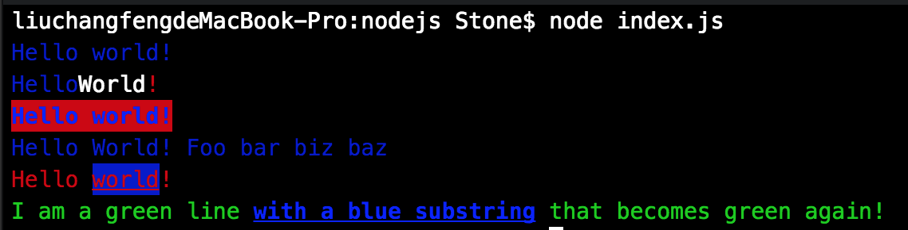

# 巧妙的属性链调用-Chalk源码解析

[Chalk](https://www.npmjs.com/package/chalk)是一个npm包，用于修饰控制台文本显示，如图示：


在其示例代码中发现如下优雅的链式调用：
```javascript
chalk.blue.bgRed.bold('Hello world!');
```
即在控制台输入红底加粗的蓝色'Hello world!'.

一般理解的链式调用是多个实例方法的链式调用，类似如：
```javascript
chalk.blue().bgRed().bold('Hello world!');
```

显然带上调用符'()', 代码显得丑多了，通过属性实现链式调用如何实现呢？

首先想到，这些实例成员应该是通过 Object.definePropertie 实现的，虽然是属性但其本质也是函数，存在内部的getter/setter.
但即便如此，其对外接口依然是属性，在JavaScript中，属性与方法的地位是相同的，函数成员也是一种数据属性。

这里的关键在于实例成员，如blue, bgRed, bold, ...需要能够即可以作为属性访问，也可以作为函数运行，即相同的成员标识符有两种使用方式。
好像单纯依赖一个Chalk类难以实现。

翻开源码（为求简洁，已除去兼容性及附加功能代码）：
```javascript

var ansiStyles = require('ansi-styles');
var supportsColor = require('supports-color');
var defineProps = Object.defineProperties;

// Chalk构造函数
function Chalk(options) {}

// 定义放到构造器原型链上的属性成员.
var styles = (function () {
	var ret = {};
	Object.keys(ansiStyles).forEach(function (key) {
		ret[key] = {
			get: function () {
				return build.call(this, this._styles.concat(key));
			}
		};
	});
	return ret;
})();
var proto = defineProps(function chalk() {}, styles);

// 生成构造器.
function build(_styles) {
	var builder = function () {
		return applyStyle.apply(builder, arguments);
	};
	builder._styles = _styles;	// 暂存属性名称
	// __proto__ is used because we must return a function, but there is
	// no way to create a function with a different prototype.
	/* eslint-disable no-proto */
	// 构造器要确保，即可以接着访问属性成员，也可以执行其本身.
	builder.__proto__ = proto;
	return builder;
}

// 最终生成格式化文本对应的字符串.
function applyStyle() {
	// support varags, but simply cast to string in case there's only one arg
	var str = String(arguments[0]);
	var nestedStyles = this._styles;
	var i = nestedStyles.length;
	while (i--) {
		var code = ansiStyles[nestedStyles[i]];
		// Replace any instances already present with a re-opening code
		// otherwise only the part of the string until said closing code
		// will be colored, and the rest will simply be 'plain'.
		str = code.open + str.replace(code.closeRe, code.open) + code.close;
	}
	return str;
}

function init() {
	var ret = {};
	Object.keys(styles).forEach(function (name) {
		ret[name] = {
			get: function () {
				//通过Chalk实例访问属性时，本质上是生成一个build函数.
				return build.call(this, [name]);
			}
		};
	});
	return ret;
}

// 在Chalk原型链上定义属性成员。
defineProps(Chalk.prototype, init());

// 返回Chalk单体实例，因为一般地使用一个实例就够了.
// 如果不够的话，可以用 new chalkObj.constructor(options) 创建自定义的实例.
module.exports = new Chalk();


```

可以看到：
主要存在两部分，Chalk构造函数 与 build方法. 最终对外返回一个单体Chalk实例。
Chalk的原型链上，通过Object.defineProperties定义了所有的属性成员，访问这些属性成员时(chalk.blue)，其get函数执行，返回一个build方法(构造器)。

构造器本身的原型链上也存在全量的属性成员，访问它的属性成员时(chalk.blue.bgRed)，它根据自身已保存的属性名称(_styles--一个数组)以及当前正调用的属性名称，再构建一个新的构造器。

如果再执行属性成员访问，则循环此步骤；如果执行属性的方法调用(chalk.blue.bgRed.bold('Hello world!')), 则执行build函数，根据所有保存下来的属性名称与调用参数生成可打印出特效文本的字符串。

总之： 在chalk实例上与属性实例上调用属性均是返回builder, 在builder使用调用符'()',则执行builder本身。
