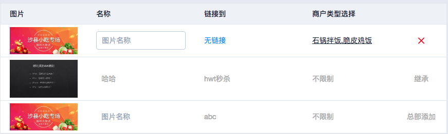

# 关于CSS伪元素及伪类的使用

最近开发CMS平台时，遇到一个需求，如图所示：

要求：
1. 表格行根据数据来源分为三种：本地，继承，总部添加。
2. 本地行可编辑，可删除，列内容自定义。
3. 继承与总部添加的行，不允许编辑删除，为只读模式，且需要显示其来源。

本地行数据的row模板已开发完成，一般来讲，需要再开发简化版的‘继承’与‘总部添加’行的内容模板。
一开始想得复杂了点，后来想到这个其实很简单，仅用几行CSS实现了以上需求，如下代码所示:

```css
/*‘总部添加’与‘继承’行的公共样式*/
tr.from-parent-node, tr.from-prev-node{
	pointer-events: none;	/*使不响应鼠标事件*/
	td *{	/*使行风格变灰*/
		color:#AAA!important;
		text-decoration: none;
		border: none!important;
	}
	td:last-child{	/*最后一列，隐藏原有内容，添加伪元素*/
		.cell:after{
			content: '';
			font-size:14px;
			color:#AAA;
		}
		.cell *{	/*隐藏单元格原有的删除按钮*/
			display: none;
		}
	}
}
/*'总部添加'行的特殊标识*/
tr.from-parent-node{
	td:last-child{
		.cell:after{
			content: '总部添加';
		}
	}
}
/*'继承'行的特殊标识*/
tr.from-prev-node{
	td:last-child{
		.cell:after{
			content: '继承';
		}
	}
}
```

以上代码中可以看到,实现需求主要基于2点：
1. after伪元素的使用.
2. pointer-events的使用

CSS本身是为了控制DOM的展示样式，但随着其功能不断丰富，现在不仅仅能够控制样式，也能有限地修改DOM内容，或影响用户交互。

# 关于伪类与伪元素

## 定义


> 伪类：A CSS pseudo-class is a keyword preceded by a colon (:) that is added on to the end of selectors to specify that you want to style the selected elements only <b>when they are in certain state</b>.
For example you might want to style an element only when it is being hovered over by the mouse pointer, or a checkbox when it is disabled or checked, or an element that is the first child of its parent in the DOM tree.


> 伪元素：Pseudo-elements are very much like pseudo-classes, but they have differences. They are keywords — preceded by two colons (::) — that can be added to the end of selectors to <b>select a certain part of an element</b>.


很明显：伪类匹配处于某种状态的元素；伪元素匹配元素的一部分(也称作虚拟节点)。

## 常用伪类：

| 语法 | 描述 | 语法 | 描述 |
|:--|:--|:--|:--|
|:not(selector)|元素不包含指定的选择器时|:checked|元素被选中时,如checkbox、radio.|
|:disabled|元素被禁用时|:empty|元素为空节点时|
|:enabled|元素可用时|:first-child|元素作为其父元素的第一个子节点时|
|:fullscreen|元素在页面全屏时|:focus|元素获得焦点时|
|:hover|鼠标悬浮该元素之上时|:last-child|元素作为其父元素的最后一个子节点时|
|:link|元素是一个有效的超链接时|:visited|被访问过的超链接|
|:active|被激活的超链接|:target|元素被url中的hash指向时|

## 常用伪元素：

| 语法 | 描述 | 语法 | 描述 |
|:--|:--|:--|:--|
|::after|容器元素结尾所插入的内容|::before|容器元素开头所插入的内容|
|::first-letter|文本内容的第一个字母|::first-line|文本内容的第一行|
|::selection|文本内容的选中部分|&nbsp;|&nbsp;|


# 伪元素before与after的特殊说明

::before与::after含义为‘内容的开头与结尾’，所以仅对容器元素有效。[由于历史兼容性原因也可以通过单引号使用:before与:after.](http://stackoverflow.com/questions/21676996/what-is-the-difference-between-after-and-after/21677110#21677110), [也可参考另外一个stackoverflow问答(Should I use single or double colon notation for pseudo-elements?)](http://stackoverflow.com/questions/10181729/should-i-use-single-or-double-colon-notation-for-pseudo-elements)


# pointer-events是什么？

pointer-events:none;可以阻止元素响应鼠标事件，鼠标可‘穿透’该元素，就好像它不存在一样。
具体用法参考：
1. [MDN pointer-events](https://developer.mozilla.org/en-US/docs/Web/CSS/pointer-events)。
2. [CSS3-pointer-events 应用举例及扩展](http://www.zhangxinxu.com/wordpress/2011/12/css3-pointer-events-none-javascript/)
